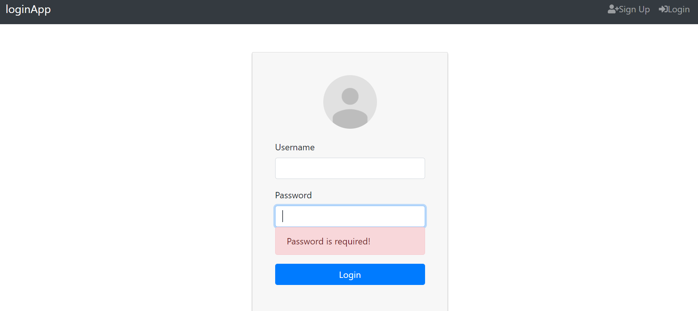

# java-assignment-3
## Building a Full Stack Login app with Spring Boot, Spring Security, JWT, Vue.js and MySQL



1. **Clone the application**

	```bash
	git clone https://github.com/Shpakovsky94/java-assignment-3.git
	cd 02-backend
	```

2. **Change MySQL username and password as per your MySQL installation**

	+ open `src/main/resources/application.properties` file.

	+ change `spring.datasource.username` and `spring.datasource.password` properties as per your mysql installation

3. **Run the app**

	You can run the spring boot app by typing the following command -

	```bash
	mvn spring-boot:run
	```

	The server will start on port 8082.

	You can also package the application in the form of a `jar` file and then run it like so -

	```bash
	mvn package
	java -jar target/java-assignment-3.jar
	```
4. **Default Roles**

	Any new user who signs up to the app is assigned the `USER` by default.

## Steps to Setup the Vue.js Front end app (03-frontend)

First go to the `03-frontend` folder -

```bash
cd 03-frontend
```

Then type the following command to install the dependencies and start the application -

```bash
npm install && npm serve
```

The front-end server will start on port `8081`.